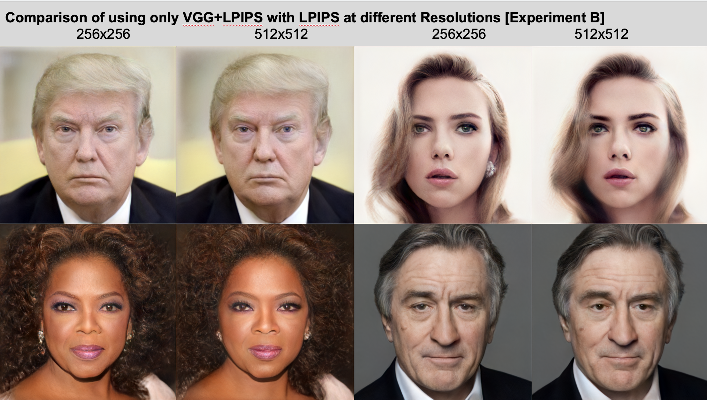
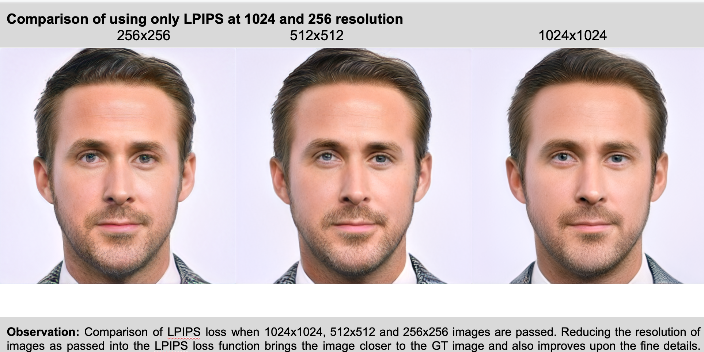
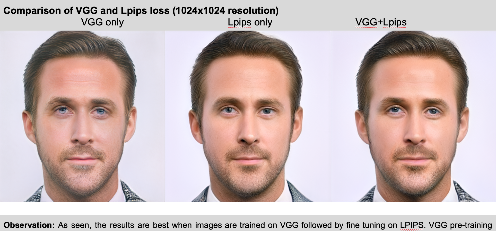
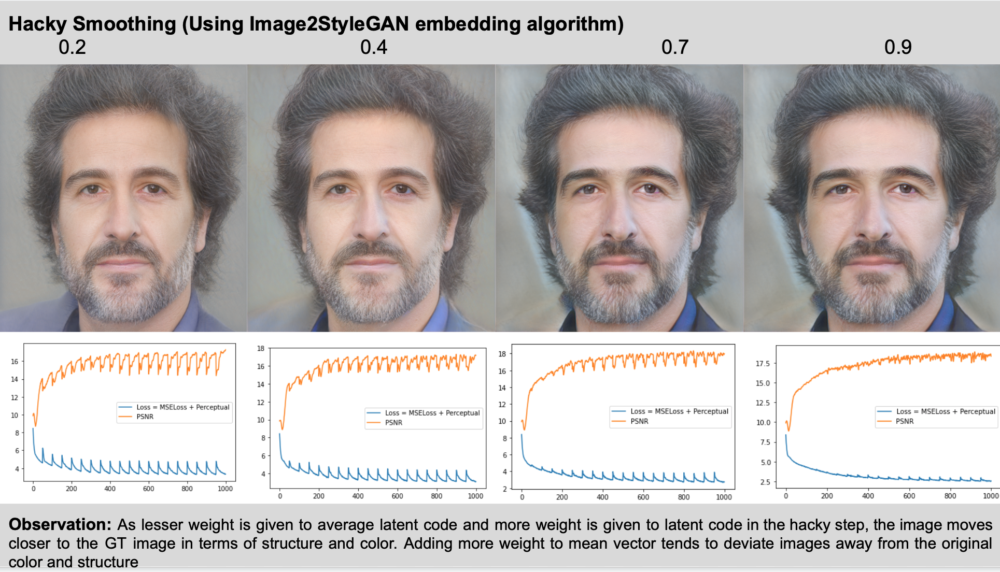
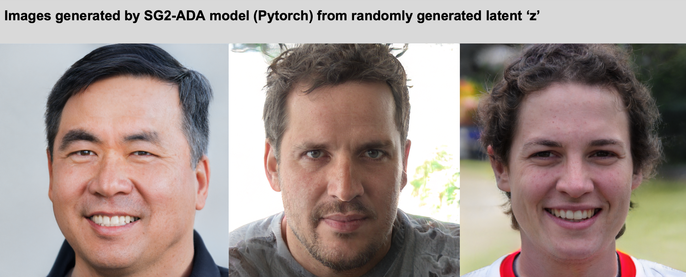

# StyleGAN2-ADA
This is an implementation of Image2StyleGAN embedding algorithm and various experiments using StyleGAN2-ADA as backbone.

## Acknowledgement

This project is a part of my internship at King Adbullah University of Science and Technology(KAUST) under the supervision of Professor Peter Wonka

## References
Model details and custom CUDA kernel codes are from official repostiories: https://github.com/NVlabs/stylegan2

Codes for Learned Perceptual Image Patch Similarity, LPIPS came from https://github.com/richzhang/PerceptualSimilarity

The code for the backbone architecture based on StyleGAN2 was taken from https://github.com/rosinality/stylegan2-pytorch

## Pre-trained Model

The pre-trained weights file used for all experiments can be found here: [Google Drive](https://drive.google.com/file/d/1mG27qCxJd1hp7uGpCScNgaw8U-iO2nSg/view?usp=sharing)
If you need any additional information, please feel free to contact me.

## Experimental Results

Stay tuned for some more results on various experimental results.
